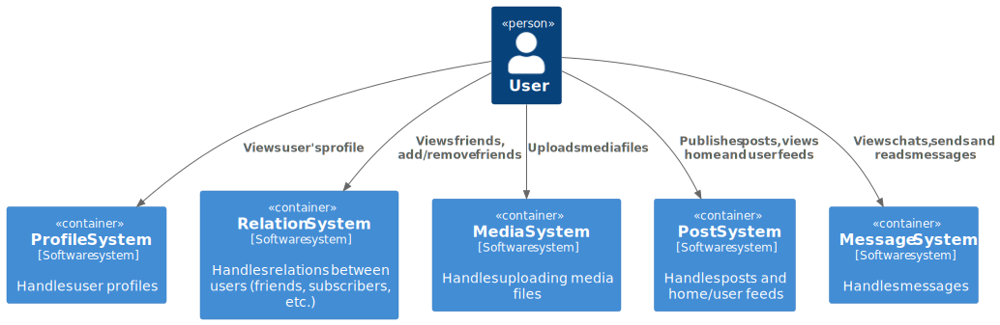
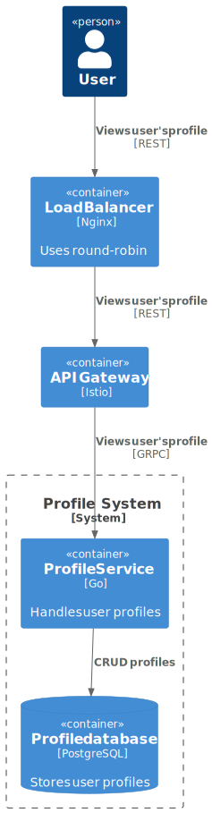
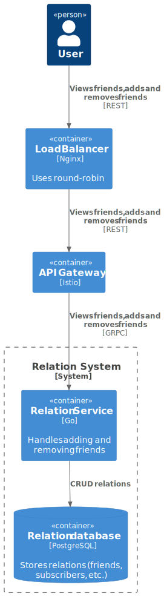
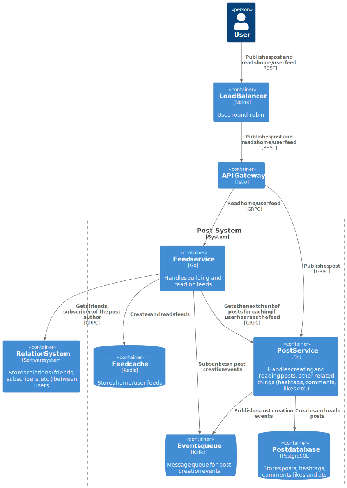
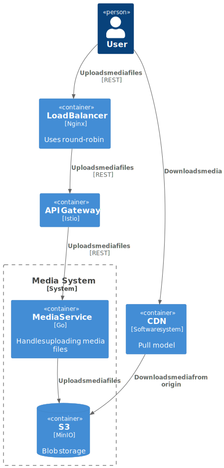
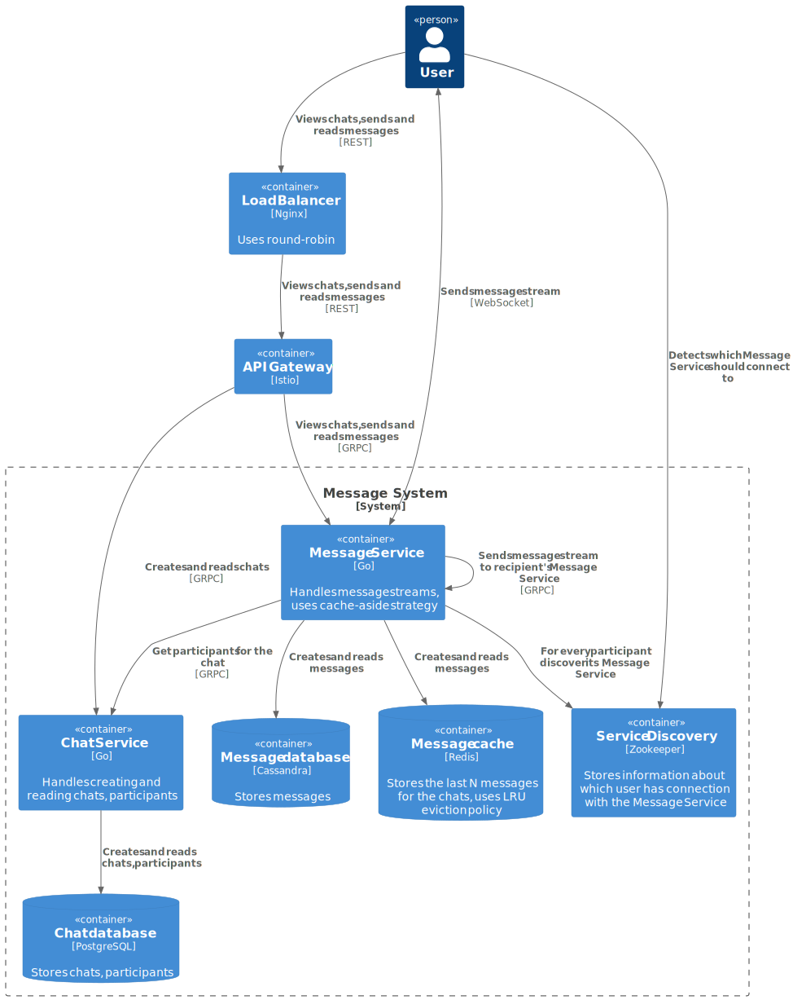

# Social network - System Design

This repository describes the system design of social network
within [the course](https://balun.courses/courses/system_design).

## Requirements

The system should meet the following requirements:

### Functional requirements

- Add and delete friends
- View users' friends
- View user's profile
- Publish posts
- View feed of posts (home and user feed)
- Upload media files for posts
- Send and read messages in one-on-one and group chats
- View one-on-one and group chats

### Non-functional requirements

- 50 000 000 DAU
- Availability 99.99% (52.56 minutes downtime per year)
- The system should be scalable and efficient
- Each user sends an average of 1 post per 3 day
- Each user reads feeds an average of 10 times per day
- The size of each post is a maximum of 3000 characters
- The size of each media files is a maximum 1MB
- 10% of posts contain media files
- Each post has a maximum 3 media files
- A message should reach the recipient in 3 seconds
- Each user sends an average of 10 messages per day
- Each user reads messages an average of 20 times per day
- The size of each message is a maximum of 1000 characters
- A user can have a maximum of 1000 friends
- A group can have a maximum of 100 participants
- Posts and messages are stored forever
- Geo distribution is not supported (CIS only)
- No seasonality

## Basic estimation

### RPS

#### Send posts

$$
\frac{50 \space million}{(3 \space \times 24 \space hrs \times 3600 \space seconds)} = \sim 193 \space requests/second
$$

#### Read posts

$$
\frac{50 \space million \times 10 \space times \space per \space day}{(24 \space hrs \times 3600 \space seconds)} = \sim 5787 \space requests/second
$$

#### Send messages

$$
\frac{50 \space million \times 10 \space messages \space per \space day}{(24 \space hrs \times 3600 \space seconds)} = \sim 5787 \space requests/second
$$

#### Read messages

$$
\frac{50 \space million \times 20 \space times \space per \space day}{(24 \space hrs \times 3600 \space seconds)} = \sim 11574 \space requests/second
$$

### Traffic

#### Send posts

Text traffic:

$$
{193 \space requests/second \times 2 \times 3000 \space bytes} = \sim 1.2 \space MB/second
$$

Media files traffic:

$$
{193 \space requests/second \times 0.1 \times 3 \times 1 \space MB} = \sim 57.9 \space MB/second
$$

Total:

$$
{1.2 \space MB/second + 57.9 \space MB/second} = 59.1 \space MB/second
$$

#### Send messages

$$
{5787 \space requests/second \times 2 \times 1000 \space bytes} = \sim 11.6 \space MB/second
$$

### Storage

Database size for storing messages for 5 years:

$$
{11.6 \space MB/second \times (24 \space hrs \times 3600 \space seconds) \times 365 \space days \times 5 \space years} = \sim 1.83 \space PB
$$

Database size for storing posts for 5 years:

$$
{59.1 \space MB/second \times (24 \space hrs \times 3600 \space seconds) \times 365 \space days \times 5 \space years} = \sim 9.32 \space PB
$$

Total:

$$
{1.83 \space PB + 9.32 \space PB} = 11.15 \space PB
$$

Number of disks (disk capacity = 16 TB):

$$
\frac{11.15 \space PB \times 1000}{16 \space TB} = \sim 697 \space number \space of \space disks
$$

## Design overview

  

    <b>Level 1.</b> System context diagram

  

    <b>Level 2.</b> Profile system container diagram

  

    <b>Level 2.</b> Relation system container diagram

  

    <b>Level 2.</b> Post system container diagram

  

    <b>Level 2.</b> Media system container diagram

  

    <b>Level 2.</b> Message system container diagram

